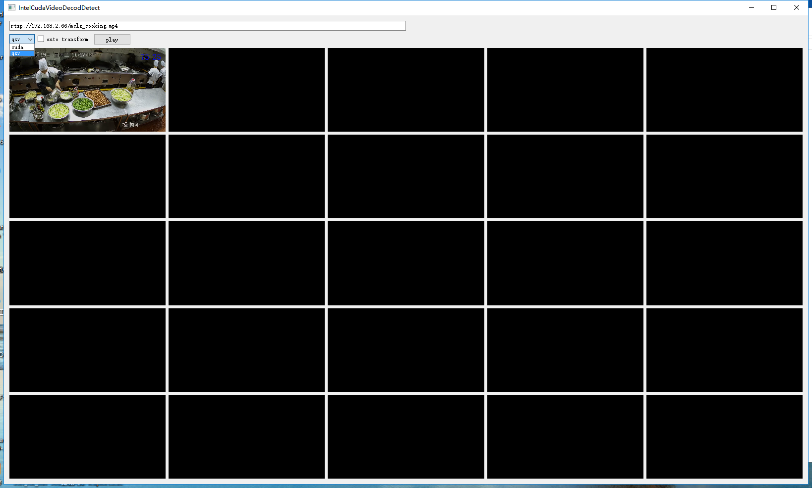

## IntelCudaVideoDecodDetect
一个使用ffmpeg硬解码的测试工具，加入了Qt显示，用于测量解码性能;目前包括cuda和qsv解码。
测量时可关闭显示，观看帧率以判断解码性能

## 编译环境
* windows 64bit
* ffmpeg-4.3 [https://ffmpeg.zeranoe.com/builds/](https://ffmpeg.zeranoe.com/builds/)
  * Version 选择版本4.3
  * Architecture 选择64bit
  * Linking Dev下载一次，Shared和Static选一个下载；我的工程是使用的Shared
* nvidia独立显卡
  * 驱动版本436.15或以上
* cpu
  * 建议i5及以上
  * 带核显，需要将显示器接到核显。本程序接到独显，qsv解码会失败
  * 下载IntelMedia-SDK[https://software.intel.com/content/www/cn/zh/develop/tools/media-sdk.html](https://software.intel.com/content/www/cn/zh/develop/tools/media-sdk.html)
  * 安装好后，需要将C:\Program Files (x86)\IntelSWTools\Intel(R) Media SDK 2020 R1\Software Development Kit\include里面再建一个mfx目录，把所有头文件放进去
* Qt
  * 低版本注意配置qopenglwidget，高版本不用配置

## 编译
* 打开.pro，选择64bit。
* 配置ffmpeg的头文件和库文件路径
* 编译

## 运行
* 默认为带视频显示，地址栏输入rtsp地址。先在vlc中播放，确保视频正常
* 每次play，会依次在下面窗口播放视频
* 将videowidget.cpp中connect(m_decoThr,SIGNAL(sigFrameLoaded()),this,SLOT(update()));去掉即可去掉视频显示
* 将ffmpegqsvdecode.cpp，ffmpegqsvdecode.cpp中的av_image_copy_to_buffer去掉可以去掉拷贝
* 下载GPU-Z可以观察硬件运行情况